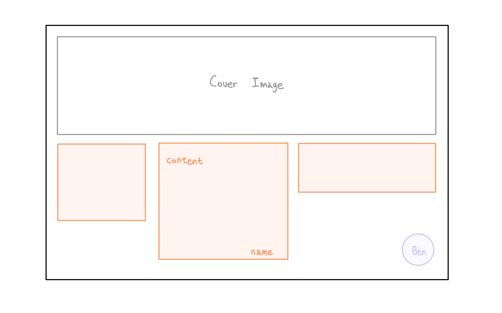
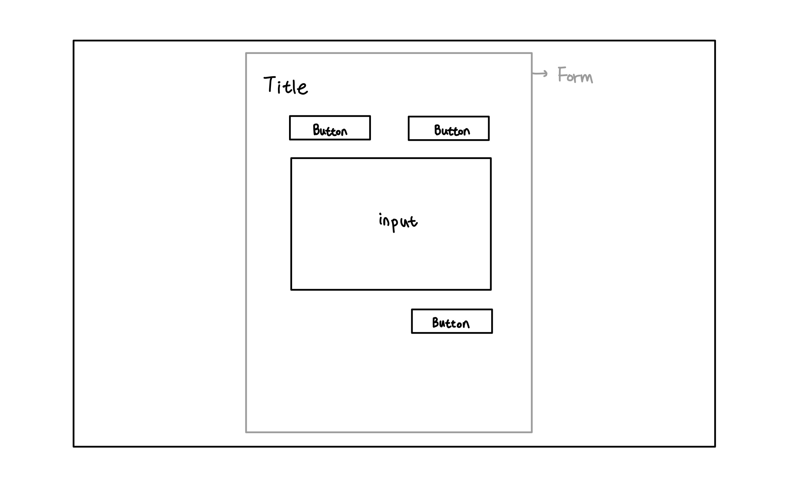

# compliment-storage-project

## 목차

- [설계](#설계)
- [트러블 슈팅](#트러블-슈팅)
- [개선사항](#개선사항)

## 설계

### 목표

- `react` 와 `typescript` 를 사용해서 칭찬 보관함 만들기

### 기술 스택

- React
- typescript
- Redux
- redux-persist
- Emotion

### 공부 필요한 것들

- 텍스트 추출 API
  - [Google Cloud Vision API](https://cloud.google.com/vision?hl=ko)
  - [카카오 Vision API](https://vision-api.kakao.com/#ocr)
- [react-query](https://react-query.tanstack.com/)

### 디자인 소스

- 사이트 컬러
  - https://dribbble.com/shots/18487537-GUUULP-Landing-Hero-Animation
  - https://dribbble.com/shots/18504348-Kolibri-Stablecoin-Design-concept
- 아이템 레이아웃
  - https://dribbble.com/shots/18503228-Web-Design-for-Marketing-Agency

### 레이아웃

#### page1

- 커버 이미지 (or 텍스트)
- 칭찬 목록
  - 내용, 받은 사람
- 칭찬 추가 버튼
  - 클릭 시 폼으로 이동

#### page2

- 폼 타이틀
- 클립보드 붙여넣기 버튼
- 이미지 텍스트 추출 버튼
- 폼 인풋
- 글 작성 버튼

## 트러블 슈팅

#### Google Vision API 작동하지 않음

- 문제

  api의 응답으로 image의 content가 이상하다는 메세지가 오며 텍스트 추출이 되지 않았다.

- 해결

  base64 string 예시를 찾아서 content의 형식을 맞춰주었다.

#### Google Vision API .png 처리 오류

- 문제

  위 문제를 해결한 뒤 .jpg 파일은 처리가 되지만 .png 파일은 처리가 되지 않는다.

- 생각 중인 해결 방법

  Cloud Storage 또는 웹에 호스팅

#### emotion 적용

- 문제

  현재 설치된 CRA로 만든 앱에서는 `jsxImportSource` 옵션을 무시하기 때문에 pragma를 작성하거나 babel 설정을 바꿔주지 않으면 스타일 작성 시 에러가 발생한다.

- 해결

  각 파일에 pragma를 추가했다. 하지만 비효율적이기 때문에 babel 설정을 바꾸는 법을 찾아봐야 할 듯하다.

#### react-router-dom useNavigate 관련 에러

- 문제

  useNavigate 훅은 Router 컴포넌트 내에서만 사용할 수 있다는 에러가 발생했다.

- 해결

  useNavigate가 react context를 얻으려면 context provider를 사용하는 라우터 컴포넌트의 자식으로 렌더링해야 한다. 따라서 Router 기반의 컴포넌트인 BrowserRouter를 index.tsx로 옮겨주었다.

  (참고한 글: https://stackoverflow.com/questions/70491774/usenavigate-may-be-used-only-in-the-context-of-a-router-component)

## 개선사항

- [x] 날짜 기록할 수 있도록 폼에 input 추가 및 인터페이스 수정
- [x] 수정, 삭제 기능 추가
- [ ] 이미지에서 텍스트 추출: `.png` 처리
- [ ] 카드 배치 CSS
- [ ] compliment item의 key 변경 고민해보기(인덱스는 바뀌는 값이므로)
